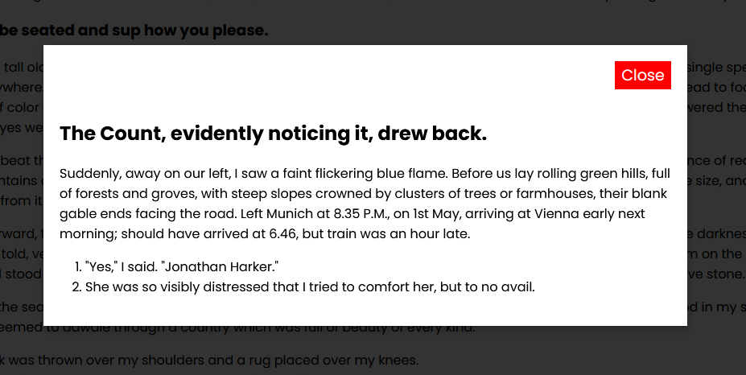
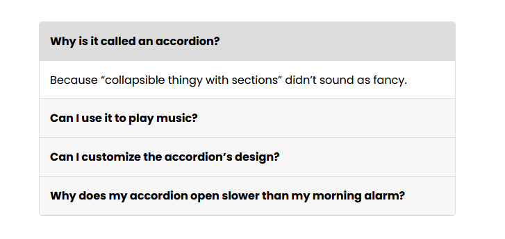
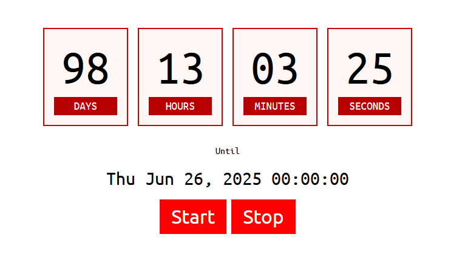

# ElKit

ElKit is a lightweight, modular JavaScript library designed to simplify UI component development. It offers customizable, accessible, and easy-to-integrate components like Modals, Accordions, Countdowns, and more.

## Features

- 🚀 **Modular**: Use only what you need.
- 🎯 **Customizable**: Configure components to match your design.
- ⚡ **Lightweight**: No unnecessary bloat.
- 🔧 **Configurable**: Supports detailed customization for each component.

## Installation

You can include the CSS and JavaScript files for each component you need via CDN:

### For CSS and JS (Minified for Production)
```html
<link rel="stylesheet" href="https://cdn.jsdelivr.net/gh/9itish/elkit@1.0.4/dist/ElKitModal/ElKitModal.css">
<script src="https://cdn.jsdelivr.net/gh/9itish/elkit@1.0.4/dist/ElKitModal/ElKitModal.min.js"></script>
```

### For ESM (Module)
```javascript
import { ElKitModal } from 'https://cdn.jsdelivr.net/gh/9itish/elkit@1.0.4/dist/ElKitModal/ElKitModal.esm.js';
```

### For CommonJS (Node)
```javascript
const ElKitModal = require('https://cdn.jsdelivr.net/gh/9itish/elkit@1.0.4/dist/ElKitModal/ElKitModal.cjs.js');
```

### For UMD (Universal)
```html
<script src="https://cdn.jsdelivr.net/gh/9itish/elkit@1.0.4/dist/ElKitModal/ElKitModal.umd.js"></script>
```

## Usage

Since ElKit is modular, you can import only the components you need using the appropriate format:

### Using ESM (Module)
```javascript
import ElKitModal from 'https://cdn.jsdelivr.net/gh/9itish/elkit@1.0.4/dist/ElKitModal/ElKitModal.esm.js';
import ElKitAccordion from 'https://cdn.jsdelivr.net/gh/9itish/elkit@1.0.4/dist/ElKitAccordion/ElKitAccordion.esm.js';
import ElKitCountdown from 'https://cdn.jsdelivr.net/gh/9itish/elkit@1.0.4/dist/ElKitCountdown/ElKitCountdown.esm.js';
```

### Using UMD (Universal)
```html
<script src="https://cdn.jsdelivr.net/gh/9itish/elkit@1.0.4/dist/ElKitModal/ElKitModal.umd.js"></script>
<script src="https://cdn.jsdelivr.net/gh/9itish/elkit@1.0.4/dist/ElKitAccordion/ElKitAccordion.umd.js"></script>
<script src="https://cdn.jsdelivr.net/gh/9itish/elkit@1.0.4/dist/ElKitCountdown/ElKitCountdown.umd.js"></script>
```

## Components

### 1. Modal

Create dynamic, customizable modals with backdrop and keyboard support.



#### Features

1. Change Modal content dynamically.
2. Provide configuration options like max height, max width, and scrollable body.
3. Specify which keys should close the modal when pressed.
4. Open programatically or through data attributes on different elements.
5. Easily change Modal appearance through CSS variables.
6. Provide callbacks for closing and opening a Modal.

#### Example

```javascript
let firstModal = new ElKitModal({
    sourceSelector: '.first-modal',
    config: {
        closingKeys: ["Escape"],
        maxWidth: "600px",
        scrollableBody: true
    }
});

firstModal.open();
```

You can also use the `data-el-modal` attribute to specify the modal that should popup when any element is clicked.

```html
<button data-el-modal=".instruction-modal">See Instruction</button>
```

### 2. Accordion

Build collapsible content sections with ease.

#### Features

1. Dynamically add or remove collapsible sections.
2. Set some sections to be always open.
3. Specify if some sections should be open at the beginning.
4. Provide a callback that executes when a section closes or opens.



#### Example

```javascript
let firstAccordion = new ElKitAccordion({ 
    selector: '#first-accordion', 
    collapseOthers: true, 
    openIndexes: [0], 
    alwaysOpen: [0] 
});

firstAccordion.addQuestion('Why does my accordion open slower than my morning alarm?', 'Might be the 5000ms transition you added. Snail mode isn’t trendy yet.');
```


### 3. Countdown Timer

Add one or more countdown timers to a webpage.



#### Features

1. Either provide a duration or an end date for a timer.
2. Start, pause, resume, or stop a timer on demand.
3. Execute callback functions on starting, pausing, resuming, and stopping a timer.
4. Callback functions also available for update and completion events.
5. Be creative with the accompanying HTML, just provide us the selectors to update.

#### Examples

```javascript
const countdown = new ElKitCountdown({
    wrapperSelector: '#countdown-a',
    timeSelectors: { d: '.days .cnt', hh: '.hours .cnt', mm: '.minutes .cnt', ss: '.seconds .cnt' },
    endTime: new Date("2025/06/26")
});

countdown.start();
```

## Configuration
Each component supports a variety of options for complete customization. Check the [Documentation](#) for detailed configuration options.

Documentation to be done!

## Contributing
We welcome contributions! Please check out our [Contributing Guide](#) to get started.

## License
This project is licensed under the MIT License. See the LICENSE file for details.

## Contact
For questions or feedback, feel free to reach out via [GitHub Issues](#).